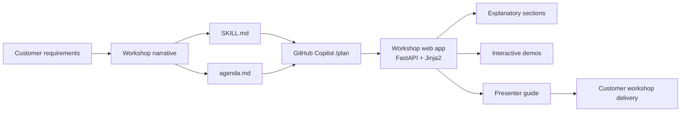

# End-to-end flow (Mermaid source)

```mermaid
flowchart LR
    A[Customer requirements] --> B[Workshop narrative]
    B --> C[SKILL.md]
    B --> D[agenda.md]
    C --> E["GitHub Copilot /plan"]
    D --> E
    E --> F[Workshop web app<br/>FastAPI + Jinja2]
    F --> G[Explanatory sections]
    F --> H[Interactive demos]
    F --> I[Presenter guide]
    I --> J[Customer workshop delivery]
```
