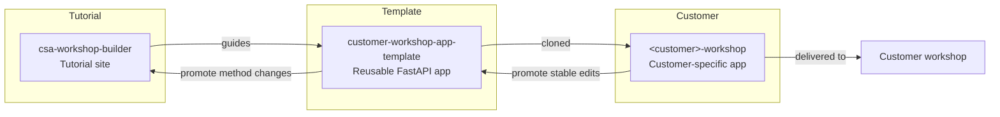
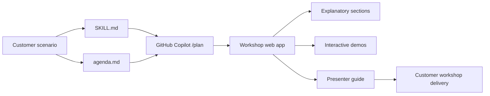

# Accelerator flow (Mermaid source)

This is the canonical three-repo + lifecycle diagram. The rendered SVG version
is at `docs/assets/images/three-repo-flow.svg`.

```mermaid
flowchart LR
    subgraph Tutorial
      A["csa-workshop-builder<br/>Tutorial site"]
    end
    subgraph Template
      B["customer-workshop-app-template<br/>Reusable FastAPI app"]
    end
    subgraph Customer
      C["&lt;customer&gt;-workshop<br/>Customer-specific app"]
    end
    A -- guides --> B
    B -- cloned --> C
    C -- delivered to --> D[Customer workshop]
    C -- "promote stable edits" --> B
    B -- "promote method changes" --> A
```

## Lifecycle

```mermaid
flowchart LR
    S[Customer scenario] --> SK[SKILL.md]
    S --> AG[agenda.md]
    SK --> P["GitHub Copilot /plan"]
    AG --> P
    P --> APP[Workshop web app]
    APP --> EX[Explanatory sections]
    APP --> DM[Interactive demos]
    APP --> PG[Presenter guide]
    PG --> DL[Customer workshop delivery]
```
