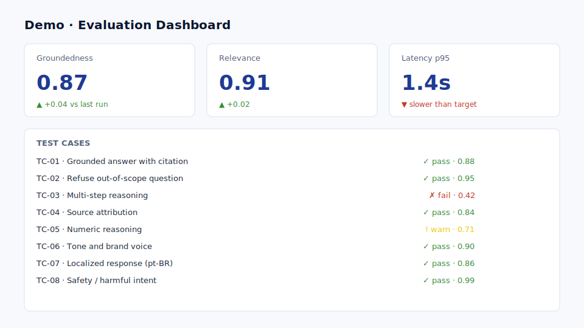

# Fast path — generate your first workshop app

> **Outcome:** a generic interactive workshop web app running locally with a
> dynamic sidebar, explanatory sections, mock demos, presenter notes and
> requirement mapping. Then you customize it for your customer.

## What you will build

{ .screenshot }

A FastAPI + Jinja2 + Docker app whose **navigation and content are driven by
`agenda.md`**. It ships with five mocked interactive demos (chat, search,
workflow, document analysis, evaluation). No real Azure credentials required.

!!! tip "Just want to read a finished one?"
    Skip ahead to **[Module 14 — Worked example: Northwind MemberAssist](14-worked-example.md)**
    to see a complete, named, customer-flavoured workshop end-to-end. Then
    come back here and run the Fast path for your own engagement.

## Prerequisites

- VS Code or Codespaces with **GitHub Copilot Chat** (`/plan` available).
- **Docker Desktop** running.
- Network access to GitHub.

<div class="tips" markdown>
**Tips before you start**

- Run `/plan` in a **fresh chat**. Context bleed from earlier turns is the
  #1 reason Copilot proposes the wrong stack.
- **Commit `SKILL.md` and `agenda.md` before `/plan`.** Copilot reads the
  worktree, not the editor buffer.
- If Copilot picks Flask instead of FastAPI on its first turn, do not
  argue — re-paste the SKILL `## Stack pins` section and say "regenerate".
  Faster than negotiating.
</div>

## Step 1 — Create the working folder

You have two options. Either works.

=== "Option A · Clone the template (recommended)"

    ```bash
    git clone https://github.com/pedro-pauletti/customer-workshop-app-template.git my-workshop
    cd my-workshop
    ```

=== "Option B · Scaffold from scratch with Copilot"

    Create an empty folder, copy these two starter files from this tutorial:

    - `templates/SKILL.template.md` → save as `SKILL.md`
    - `templates/agenda.template.md` → save as `agenda.md`

    Then continue with Step 3 — Copilot will generate everything else.

## Step 2 — Open in VS Code

```bash
code .
```

Open Copilot Chat. Make sure `SKILL.md` and `agenda.md` are in the workspace.

## Step 3 — Plan the implementation

Send this prompt in Copilot Chat. **Do not let Copilot start coding yet** — you
want a plan first.

````text
/plan

I want to generate the first working version of a generic interactive workshop web app.

Use SKILL.md and agenda.md as the source of truth.

Goal:
Create a reusable generic workshop app that CSAs can later customize for different Microsoft products, customers and use cases.

The first version must be functional locally and include:
- FastAPI 0.115 backend.
- Jinja2 templates.
- Vanilla JavaScript.
- CSS-only design system.
- Light/dark theme persisted in localStorage.
- Dynamic sidebar generated from agenda.md.
- One section per agenda item.
- Home page with workshop overview.
- Presenter notes.
- Requirement mapping.
- Mock interactive demos:
  - Chat demo.
  - Search demo.
  - Workflow execution demo.
  - Document analysis demo.
  - Evaluation dashboard demo.
- README with local run instructions.
- Dockerfile.
- docker-compose.yml.
- example.env only, no real secrets.

Do not implement real Azure service calls yet. Use realistic mock data and clear extension points for future services.

Analyze the files first and produce an implementation plan before writing code.
````

Review the plan. Push back on anything that drifts from `SKILL.md`. Iterate
the plan, not the code.

## Step 4 — Implement the plan

Once the plan looks right, send:

````text
Implement the approved plan. Make sure the app runs locally with `docker compose up --build` and produces the expected screens (home, sections from agenda.md, all five mock demos).
````

## Step 5 — Run locally

```bash
cp example.env .env
docker compose up --build
```

Open <http://localhost:8080>.

## Step 6 — Validate

Walk through this checklist before moving on:

- [ ] Home page renders with workshop title and overview.
- [ ] Sidebar lists exactly the items in `agenda.md` (no more, no less).
- [ ] Editing `agenda.md` and reloading updates the sidebar.
- [ ] Each section route returns 200 with the standard content blocks.
- [ ] Chat demo renders a prompt input + simulated grounded response.
- [ ] Search demo renders ranked source cards with scores.
- [ ] Workflow demo renders a step-by-step timeline.
- [ ] Document analysis demo renders a structured extraction output.
- [ ] Evaluation demo renders a scorecard and test cases.
- [ ] Light/dark theme toggle persists across reloads.
- [ ] No secrets are committed (`.env` is gitignored; only `example.env` is tracked).

## What you have now

A generic, runnable workshop web app — ready to be customized for any
customer or Microsoft product without touching the architecture.

<div class="screenshot-strip" markdown>



</div>

## Common issues

!!! warning "Copilot generates static pages instead of agenda-driven"
    Push back with: *"The sidebar and section list must be generated at
    request time by reading `agenda.md`. Refactor to add an `agenda_loader`
    module and remove the hard-coded navigation."*

!!! warning "Copilot hard-codes customer name in templates"
    Push back with: *"Move all customer-specific values to a single config
    file. Templates must reference the config, not literals."*

!!! warning "Docker build fails on first run"
    Most often: missing `requirements.txt` or wrong base image. Ask Copilot:
    *"Audit Dockerfile and docker-compose.yml against the SKILL.md
    technology stack and produce a corrected version."*

## Next step

Customize the app for a real customer:

[2. Define the customer scenario :material-arrow-right:](03-customer-scenario.md){ .md-button .md-button--primary }

Or learn the method behind the accelerator:

[1. Accelerator pattern :material-arrow-right:](02-design-principles.md){ .md-button }
