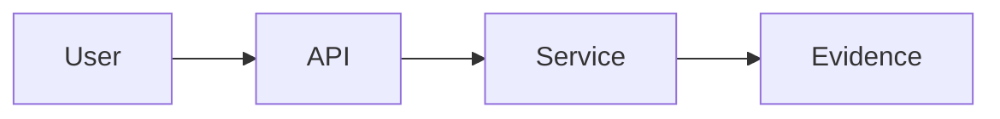

# 7. Add explanatory sections

## Goal

Enrich each section of the generated app with the **didactic content** that
makes a workshop teach, not just demo.

## Why it matters

A blank section says "demo goes here". A great section frames the concept,
shows the architecture, runs the demo, and proves the outcome. This is where
customer trust is earned.

## Inputs

- Generated app skeleton.
- Customer scenario and requirement IDs.

## Step-by-step

For each section, add the following content blocks:

1. **Customer context** — one paragraph linking back to the scenario.
2. **Learning objective** — one sentence.
3. **Requirement mapping** — list of requirement IDs covered.
4. **Concept explanation** — short, plain language.
5. **Architecture diagram** — Mermaid block.
6. **Demo placeholder** — to be filled in [Module 8](09-interactive-demos.md).
7. **Presenter notes** — talking points and timing.
8. **Success criteria** — observable outcomes.
9. **Fallback** — what to do if the live demo fails.

## Copilot prompt

```text
For every section under sections/, add the following content blocks using the
Jinja2 templates already in the project:

- Customer context (1 paragraph, references customer-scenario.md)
- Learning objective (1 sentence)
- Requirement mapping (bullet list of requirement IDs from agenda.md)
- Concept explanation (plain language, no jargon)
- Architecture diagram (Mermaid)
- Demo placeholder (leave a clearly marked TODO block)
- Presenter notes (3–5 bullet points)
- Success criteria (3 observable outcomes)
- Fallback (1 paragraph: what to show if the live demo fails)

Keep the content reusable. Do not hard-code customer name in templates;
read it from a single config file.
```

## Expected output

Every section now has consistent didactic content; only demos remain as
clearly-marked TODOs.

### Drop-in section template

Copy this into any new section template (`sections/<slug>.html` or markdown):

````markdown
## Customer context
One paragraph linking back to customer-scenario.md.

## Learning objective
One sentence — what the audience leaves knowing.

## Requirement covered
R1, R3

## Concept
Plain-language explanation. No marketing.

## Diagram


## Demo


## Evidence
- Trace ID, token usage, cost.
- Groundedness score, citations.

## Presenter notes
- 30-second exec framing.
- Where to slow down.
- Likely audience questions + answers.

## Fallback
If the live demo fails, show the recorded clip at `static/clips/<slug>.mp4`
and walk through `data/<slug>.json`.
````

{ .screenshot }

## Validation checklist

- [ ] All sections share the same content structure.
- [ ] Customer name comes from one config file.
- [ ] Each section lists the requirement IDs it covers.
- [ ] Presenter notes exist for every section.

## Common issues

!!! warning "Inconsistent tone across sections"
    Likely cause: Copilot generated each section in isolation. Re-prompt with
    "Match the tone and structure of section 01 across all sections."

## Next step

Continue to **[9. Add interactive demos](09-interactive-demos.md)**.
