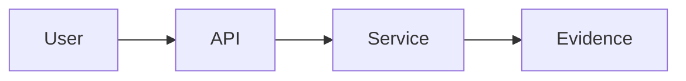
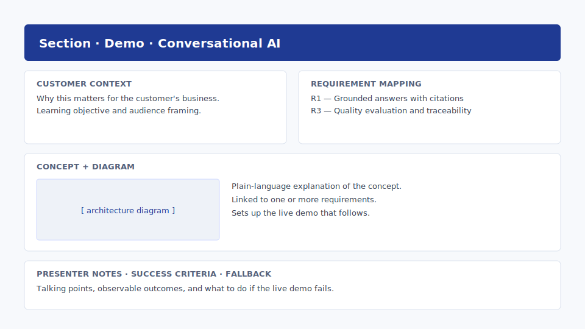

# 8. Explanatory sections — Northwind

## Goal

Enrich each of the six Northwind sections (Coverage Lookup, Claim Status,
Provider Search, EOB Extraction, Evaluation Scorecard, Roadmap) with the
**didactic content** that makes a workshop teach, not just demo.

## Why it matters

A blank section says "demo goes here". A great section frames the concept,
shows the architecture, runs the demo, and proves the outcome. This is where
customer trust is earned.

## Inputs

- Generated app skeleton.
- Customer scenario and requirement IDs.

## Step-by-step

For each section, add the following content blocks:

1. **Customer context** — one paragraph linking back to the scenario.
2. **Learning objective** — one sentence.
3. **Requirement mapping** — list of requirement IDs covered.
4. **Concept explanation** — short, plain language.
5. **Architecture diagram** — Mermaid block.
6. **Demo placeholder** — to be filled in [Module 8](09-interactive-demos.md).
7. **Presenter notes** — talking points and timing.
8. **Success criteria** — observable outcomes.
9. **Fallback** — what to do if the live demo fails.
10. **Microsoft Learn references** — 2–5 authoritative links per section
    (`learn.microsoft.com` and `github.com/Azure-Samples`).

## Ground every section in official Microsoft documentation

!!! tip "The single biggest lever on workshop credibility"
    Every explanatory block in every section must cite **at least two official
    Microsoft sources**. This is non-negotiable. It is also the easiest part
    of the workshop to get right — Microsoft Learn is comprehensive and free.

A workshop is a teaching artifact. The CSA's job is not to *originate* the
concepts but to *curate* them and apply them to the customer's situation.
That means every concept the audience hears should be traceable to
`learn.microsoft.com`, `github.com/Azure-Samples`, or the official Foundry /
Fabric / Security documentation.

### Why this matters

- **Trust.** Architects in the room will fact-check you in real time. A link
  to the Learn page closes the loop in 30 seconds; a hand-wave doesn't.
- **Reusability.** When the next CSA forks your repo six months later, the
  underlying SDK has probably moved. The Learn links update with the product;
  your prose doesn't.
- **Compliance.** Security and risk teams need an audit trail. "It's in the
  official Microsoft Learn architecture guide" is the answer they expect.
- **Time.** Writing original prose about how vector search works wastes a day.
  Citing the Learn page and contextualizing it for the customer takes 15 min.

### Where to find the right reference

| Concept area | Start here |
|---|---|
| Azure AI Search (indexing, vector, hybrid, semantic ranker, RAG) | `learn.microsoft.com/azure/search/` |
| Azure AI Foundry (agents, evaluations, projects, hub) | `learn.microsoft.com/azure/ai-foundry/` |
| Azure OpenAI (deployments, "use your data", function calling) | `learn.microsoft.com/azure/ai-services/openai/` |
| Reference RAG implementation | `github.com/Azure-Samples/azure-search-openai-demo` |
| Microsoft Fabric (lakehouse, OneLake, Direct Lake) | `learn.microsoft.com/fabric/` |
| Responsible AI (groundedness, safety, content filters) | `learn.microsoft.com/azure/ai-foundry/responsible-ai/` |
| Microsoft Security (Sentinel, Defender, Copilot for Security) | `learn.microsoft.com/security/` |

### Citation block template

Every section template ships with a `refs` block. Always fill it.

```html
<div class="refs">
  <div class="refs__label">Official Microsoft Learn references</div>
  <ul>
    <li><a href="https://learn.microsoft.com/azure/search/search-what-is-azure-search">What is Azure AI Search?</a></li>
    <li><a href="https://learn.microsoft.com/azure/search/vector-search-overview">Vector search overview</a></li>
    <li><a href="https://learn.microsoft.com/azure/search/hybrid-search-overview">Hybrid search overview</a></li>
  </ul>
</div>
```

The [live demo](../demo/) shows this pattern in every section — open any of
the six sections and scroll to the bottom of the explanatory block.

### Copilot prompt — generate the citation block

```text
For each section under sections/, read the concept paragraphs and propose
2–5 official Microsoft references. Constraints:

- Only learn.microsoft.com, github.com/Azure-Samples, or microsoft.com URLs.
- Each link must back a specific claim made in the section's concept block.
- No marketing pages, no blog posts, no third-party tutorials.
- Output as the <div class="refs"> block ready to paste at the end of the
  section's explanatory content.
```

## Copilot prompt

```text
For every section under sections/, add the following content blocks using the
Jinja2 templates already in the project:

- Customer context (1 paragraph, references customer-scenario.md)
- Learning objective (1 sentence)
- Requirement mapping (bullet list of requirement IDs from agenda.md)
- Concept explanation (plain language, no jargon)
- Architecture diagram (Mermaid)
- Demo placeholder (leave a clearly marked TODO block)
- Presenter notes (3–5 bullet points)
- Success criteria (3 observable outcomes)
- Fallback (1 paragraph: what to show if the live demo fails)

Keep the content reusable. Do not hard-code customer name in templates;
read it from a single config file.
```

## Expected output

Every section now has consistent didactic content; only demos remain as
clearly-marked TODOs.

## Worked example — Northwind "Claim Status" (gold sample)

This is the gold-sample section. Copy its structure into the other five
Northwind sections.

```markdown
# Claim Status

> **Mapped requirement(s):** R3, R6
> **Time on stage:** ~18 minutes (8 explain, 7 demo, 3 Q&A)
> **Demo file:** data/claims.json
> **Section folder:** sections/claim_status/

## Customer context

Marcus (Director, Claims Ops) opens 28% of his weekly tickets because
a member called the call centre and the agent could not explain
*where* a claim was in flight. The agent had to alt-tab between
three systems and read codes the member did not understand. This
demo shows the same question answered in one screen, in plain
English, with a timestamp the member can trust.

## Concept

A claim moves through five canonical states: received → validated →
adjudicated → paid → notified. Each state is owned by a different
back-end system and emits an event. MemberAssist subscribes to
those events, normalises them to the canonical timeline, and renders
them with the source system and last-updated timestamp. Nothing is
computed; we show the truth that already exists.

## Demo

Open /sections/claim_status and run the happy-path claim
NW-CLM-2025-0418-77321, then switch to the failure-path claim
NW-CLM-2025-0301-44102 (pended for COB) and walk the human-handoff
modal.

## Evidence

The right-panel payload, source-system badges, and trace passed to
the handoff modal — all three pulled from data/claims.json so the
audience can see "what the model saw".

## Presenter notes

- Open with Marcus's number: "28% of your weekly escalations are
  variants of where is my claim. We're going to remove that ticket."
- For the pended claim, *do not* skip the handoff modal. Compliance
  watches for it.

## Common pitfalls

- Demoing only the happy path. The failure path is what makes the
  evaluation demo credible later.

## Next

EOB Document Extraction. Same claim ID, now we open the EOB.
```

Full source:
[`samples/northwind-memberassist-workshop/sections/`](https://github.com/pedro-pauletti/csa-workshop-builder/tree/main/samples/northwind-memberassist-workshop/sections)

<div class="tips" markdown>
**Section writing tips**

- One sentence of business framing > three paragraphs of feature spec.
  The audience will not read the third paragraph.
- Mermaid diagrams must fit at 1080p without zoom. If you have to zoom,
  split into two diagrams.
- Presenter notes are written for *you* a month from now. Include the
  literal sentence you say while the demo loads.
- Demo *one* failure case explicitly. Audiences trust dashboards that
  admit imperfection more than dashboards that show only green.
- Each section's last line should hand off to the next section by
  title. Builds a thread the audience can follow.
</div>

### Drop-in section template

Copy this into any new section template (`sections/<slug>.html` or markdown):

````markdown
## Customer context
One paragraph linking back to customer-scenario.md.

## Learning objective
One sentence — what the audience leaves knowing.

## Requirement covered
R1, R3

## Concept
Plain-language explanation. No marketing.

## Diagram


## Demo


## Evidence
- Trace ID, token usage, cost.
- Groundedness score, citations.

## Presenter notes
- 30-second exec framing.
- Where to slow down.
- Likely audience questions + answers.

## Fallback
If the live demo fails, show the recorded clip at `static/clips/<slug>.mp4`
and walk through `data/<slug>.json`.
````

{ .screenshot }

## Validation checklist

- [ ] All sections share the same content structure.
- [ ] Customer name comes from one config file.
- [ ] Each section lists the requirement IDs it covers.
- [ ] Presenter notes exist for every section.

## Common issues

!!! warning "Inconsistent tone across sections"
    Likely cause: Copilot generated each section in isolation. Re-prompt with
    "Match the tone and structure of section 01 across all sections."

## Next step

Continue to **[9. Add interactive demos](09-interactive-demos.md)**.

<div class="module-step"><span class="pill">Module 8 of 12</span> Sections are educational. Next: wire up the mocked interactivity.</div>
