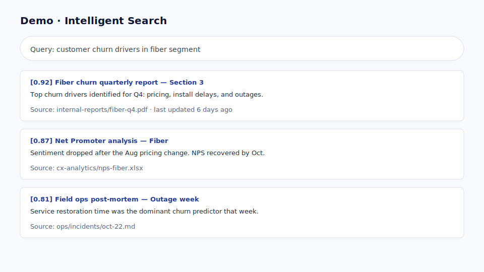
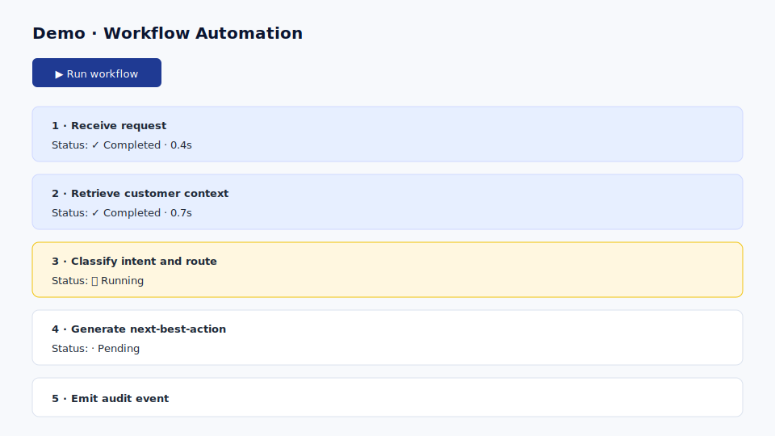
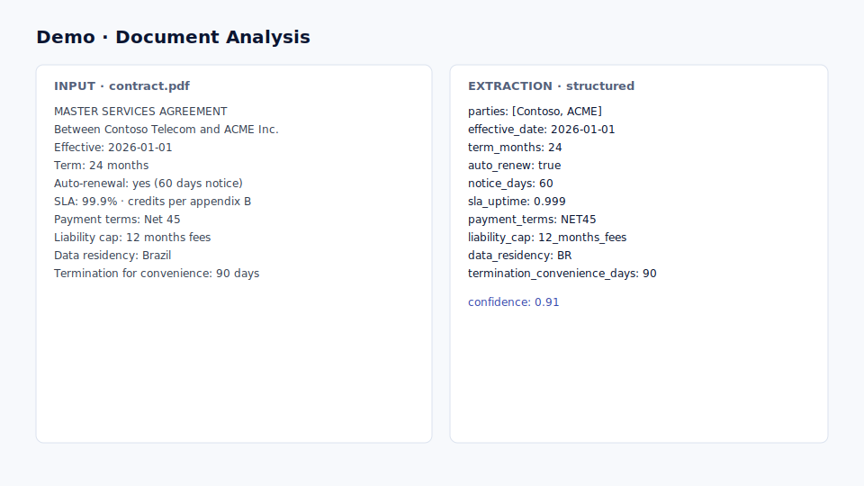

# 8. Add interactive demos

## Goal

Replace each section's demo placeholder with an **embedded, working interactive
component** — chat, search, workflow, document analysis, evaluation.

## Why it matters

Interactivity is what moves the workshop from passive viewing to active
engagement. Customers remember what they touched.

## Inputs

- Sections with demo TODO blocks from [Module 7](08-explanatory-sections.md).
- The demo type per section (from your agenda mapping table).

## Step-by-step

1. For each section, identify the demo type:
   - **Chat** — prompt input, streaming response, sources panel.
   - **Search** — query input, ranked results, source cards, score.
   - **Workflow** — run button, step-by-step timeline, status updates.
   - **Document analysis** — document picker, structured extraction output.
   - **Evaluation** — test cases, scorecards, traces.
2. Implement each as a self-contained Jinja2 partial + vanilla JS module.
3. Mock all backends locally first. Real services come later.
4. Confirm all demos work offline.

## Copilot prompt

```text
Add mock interactive demo components to the workshop app.

Required components, each as a Jinja2 partial + vanilla JS module:
- Chat demo: prompt input, simulated grounded response, sources panel.
- Search demo: query input, ranked source cards with relevance scores.
- Workflow demo: Run button, step-by-step execution timeline.
- Document analysis demo: sample document selector, structured extraction output.
- Evaluation demo: test cases, scorecards, observations.

Constraints:
- All demos must work locally with no external services.
- Structure the code so a real service (Foundry, Fabric, Search) can be plugged
  in later by replacing the mock module with a real httpx client.
- No real secrets. Use example.env for any future endpoints.
```

## Expected output

Every demo placeholder now renders a working, mocked interactive component.

## Mock data per demo

### Chat

{ .screenshot }

```json
{
  "question": "How can I reduce call center handling time?",
  "answer": "Summarize the customer's call, propose the next best action, and surface the top 3 KB articles.",
  "sources": [
    {"title": "Customer service playbook", "url": "kb://playbook/handling-time"},
    {"title": "Knowledge article KB-1024", "url": "kb://articles/1024"}
  ],
  "trace": [
    "Received user prompt",
    "Retrieved 3 documents (avg score 0.81)",
    "Generated grounded answer",
    "Scored response quality: 0.92"
  ]
}
```

### Search

{ .screenshot }

```json
{
  "query": "billing dispute resolution",
  "results": [
    {"title": "Billing disputes — agent guide", "score": 0.91, "snippet": "Open the ticket, verify identity..."},
    {"title": "Refund policy v3", "score": 0.84, "snippet": "Refunds above $X require manager approval..."},
    {"title": "Escalation matrix", "score": 0.72, "snippet": "Tier-1 unresolved within 24h → Tier-2..."}
  ]
}
```

### Workflow

{ .screenshot }

```json
{
  "workflow": "agent-assist-resolution",
  "steps": [
    {"name": "Classify intent", "status": "done", "ms": 120},
    {"name": "Retrieve KB", "status": "done", "ms": 340},
    {"name": "Draft response", "status": "done", "ms": 980},
    {"name": "Safety check", "status": "done", "ms": 110},
    {"name": "Present to agent", "status": "ready", "ms": 0}
  ]
}
```

### Document analysis

{ .screenshot }

```json
{
  "document": "invoice-2024-0042.pdf",
  "extracted": {
    "vendor": "Contoso Logistics",
    "invoice_number": "INV-2024-0042",
    "total": 12450.75,
    "currency": "USD",
    "line_items": 7,
    "due_date": "2024-11-30"
  },
  "confidence": 0.94
}
```

### Evaluation

{ .screenshot }

```json
{
  "suite": "customer-service-q4",
  "cases": 42,
  "scores": {
    "groundedness": 0.88,
    "relevance": 0.91,
    "harm": 0.02,
    "latency_p95_ms": 1450
  },
  "regressions": []
}
```

## Validation checklist

- [ ] All demos render without external network calls.
- [ ] Each demo has a clear "swap mock for real service" extension point.
- [ ] All inputs are validated client-side.
- [ ] Demos degrade gracefully (clear error UI, fallback content).

## Common issues

!!! tip "Mocks that look fake"
    Use realistic sample data drawn from the customer scenario. Generic Lorem
    ipsum kills credibility.

## Next step

Continue to **[10. Customize by product and customer](10-customization-patterns.md)**.
