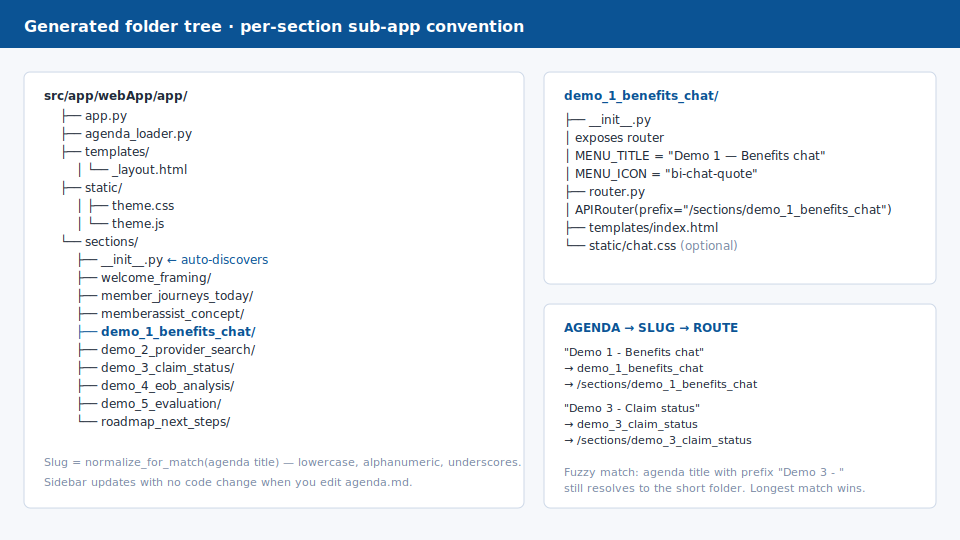

# Worked example: Northwind MemberAssist

A complete, named, customer-flavoured example you can read top-to-bottom
to see what every artifact in this tutorial *actually* looks like when
filled in.

> **Why read this module?** The previous 13 modules teach the method.
> This one shows the result. If you skim, skim this.

The full source is under
[`samples/northwind-memberassist-workshop/`](https://github.com/pedro-pauletti/csa-workshop-builder/tree/main/samples/northwind-memberassist-workshop)
in the tutorial repo.

## 60-second engagement narrative

**Northwind Health** is a fictional US regional health plan with ~1.2M
members. Their member-services call centre handles ~22,000 calls/week.
Average handle time is 7m12s; first-call resolution is 64%. The top three
call drivers are benefits-coverage questions, claim-status questions, and
provider search.

The Northwind innovation team has approved a 90-day pilot of a "member
copilot" called **MemberAssist** that augments call-centre agents (and
later, self-service). Today's workshop is the kickoff: align
member-services, claims operations, plan architects, and compliance on
what MemberAssist will and will not do, and socialize a credible
architecture.

The audience is four named people:

**Rosa Aoyama** <em>VP Member Services</em>
Reduce handle time and complaint volume without inflating QA cost.

**Marcus Boateng** <em>Director, Claims Ops</em>
Claim-status answers that match the source-of-truth adjudication system.

**Hana Whitlock** <em>Principal Plan Architect</em>
Architecture that does not lock the plan into one vendor.

**Daniel Erskine** <em>Compliance Officer</em>
PHI safeguarding, auditability, fallback to human, and traceable evals.

## Artifact chain

Every module of this tutorial produces one artifact. Northwind's chain
looks like this:

| # | Artifact | File in the sample |
|---|---|---|
| 3 | Customer scenario | `customer-scenario.md` |
| 3 | Audience matrix | (in `customer-scenario.md`) |
| 4 | SKILL.md (with frontmatter) | `.github/skills/workshop-creation/SKILL.md` |
| 5 | Agenda | `agenda.md` |
| 6 | `/plan` prompt | `prompts.md` (#1) |
| 7 | Generated app folders | (illustrated below) |
| 8 | Explanatory section (gold sample) | `sections/demo-3-claim-status.md` |
| 9 | Mock data per demo | `data/{chat,search,workflow,document,evaluation}.json` |
| 10 | Customization diff vs. generic | `customization-diff.md` |
| (presenter) | Presenter notes | `presenter-notes.md` |

## What it looks like

The branded home page with the audience badges, requirements call-out,
and the "Synthetic data — no PHI" top-bar:

{ .screenshot }

### Demo 3 — Claim status (the hero demo)

Canonical timeline (received → validated → adjudicated → paid →
notified) with the source-system badge per step, plus the explicit
human-handoff failure path that compliance always asks about:

{ .screenshot }

### Demo 4 — EOB document analysis

Drag-and-drop an EOB PDF; the app extracts 21 fields and produces a
plain-English explanation written for member literacy, not yours.

{ .screenshot }

### Demo 5 — Evaluation dashboard with PHI-leak gauge

Five scorecards. The PHI-leak gauge is intentionally in **warn** state
in the sample data — the dashboard's job is to catch drift, not to
look perfect.

{ .screenshot }

## Per-section sub-app layout

Northwind's app uses the per-section package convention from the
reference architecture (taught in module 6). Slug is computed from the
agenda title via `normalize_for_match`; the section appears in the
sidebar automatically.

{ .screenshot }

## What changed vs. the generic template

This is the abridged diff. The full version lives at
`samples/northwind-memberassist-workshop/customization-diff.md`.

| Dimension | Generic | Northwind |
|---|---|---|
| Domain | "Generic AI workshop" | US health-plan member services |
| Audience | exec / architect / dev | VP, Claims Director, Architect, Compliance |
| Compliance | Mentioned | First-class — PHI-leak gauge, redaction, handoff |
| Branding | Neutral | `#0B5394` / `#F4B400`, "no PHI" badge |
| Failure paths | Implied | One per demo, explicitly demoed |
| New mock-data files | — | 5 (chat, search, workflow, document, evaluation) |

**Tips from real engagements**

- A "warn"-state evaluation gauge in the sample buys more credibility
  than five "pass" gauges. Compliance trusts dashboards that admit
  imperfection.
- Name the personas after real attendees in your prep deck *only*. In
  the workshop itself, use the fictional names so you can show the
  sample publicly afterward without redacting.
- The hero demo (claim status here) should appear in modules 8 *and* 9
  — once as content, once as data. Audiences remember the second pass.
- Open every section with the *business* sentence, not the architecture
  one. Hana will get to architecture; Rosa won't follow if you start
  there.
- Pre-warm the EOB PDF cache before the executive read-out. Cold first
  extraction looks like a 2-second hang.

## Reuse checklist — retarget to your customer

To fork this sample into a new engagement, change these seven things in
order. Anything else (architecture, prompts, section template) should
stay untouched on engagement #1.

1. **Customer name and audience matrix** in `customer-scenario.md`.
2. **Compliance section** in `SKILL.md` (your sector's equivalent of PHI).
3. **Agenda titles** in `agenda.md` (mind the heading anchor).
4. **Branding colours and the data-classification badge** in prompt #4.
5. **All five `data/*.json` fixtures** — vocabulary the audience knows.
6. **The gold-sample section** name and its `data/` reference.
7. **Presenter notes** top-to-bottom — this is the most personal file.

## Drill-down by module

Each module of the tutorial includes a "Northwind worked example" panel
showing the slice relevant to that module:

- [Module 0 — Fast path](00-fast-path.md)
- [Module 2 — Accelerator pattern](02-design-principles.md)
- [Module 3 — Customer scenario](03-customer-scenario.md)
- [Module 4 — SKILL.md](04-create-skill.md)
- [Module 5 — agenda.md](05-create-agenda.md)
- [Module 6 — Copilot `/plan`](06-copilot-plan.md)
- [Module 7 — Generate the web app](07-generate-web-app.md)
- [Module 8 — Explanatory sections](08-explanatory-sections.md)
- [Module 9 — Interactive demos](09-interactive-demos.md)
- [Module 10 — Customize by product](10-customization-patterns.md)
- [Module 11 — Run locally](11-run-locally.md)
- [Module 12 — Publish](12-publish-github-pages.md)
- [Module 13 — Reuse and scale](13-reuse-scale.md)

## What this example deliberately does *not* do

- **No real Foundry / Azure SDK calls.** Mocks only. The real-Azure
  path is documented in module 9 under "Advanced pattern: real-Azure
  extension" using the `infra/scripts/*.ipynb` pattern.
- **No real PHI.** Every name, member ID, claim ID, provider, and EOB
  is synthetic.
- **No customer logo.** Northwind is fictional. When you fork, drop
  your customer's logo in `static/` and reference it from the home
  template — see prompt #4 in the sample.

## Next

You've now seen what "done" looks like.

- If you haven't started yet → [Fast path](00-fast-path.md).
- If you want to fork this exact sample → clone the tutorial repo and
  copy `samples/northwind-memberassist-workshop/` into a new repo named
  for your engagement.
- If you want to promote learnings back into the template →
  [Module 13 — Reuse and scale](13-reuse-scale.md).
