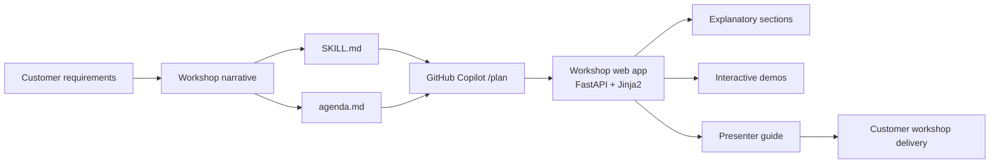

# Introduction

**How CSAs can create engaging workshops tailored to customer use cases**

A practical guide to creating customer-specific, interactive workshop web apps
with **GitHub Copilot**.

## Who this is for

Microsoft **Cloud Solution Architects (CSAs)** and technical specialists who
need to deliver hands-on, customer-specific workshops that go beyond generic
demos. The pattern works for any Microsoft product — Azure AI Foundry, Microsoft
Fabric, Microsoft Security, Microsoft 365 Copilot, Dynamics 365, GitHub Copilot.

## What you will build (by the end of this tutorial)

A reusable method — and a working **FastAPI + Jinja2 + Docker** workshop web
app — that you can adapt per customer in hours instead of weeks. The app is
**agenda-driven**: a single `agenda.md` file produces the navigation, sections,
explanatory content placeholders and embedded interactive demo slots.

## The end-to-end flow

## How to use this tutorial

Each module follows the **same 9-section pattern** so you always know what to
expect:

1. **Goal** — what you will produce.
2. **Why it matters** — how it improves the workshop.
3. **Inputs** — what you need before you start.
4. **Step-by-step** — concrete actions.
5. **Copilot prompt** — copy/paste ready.
6. **Expected output** — what success looks like.
7. **Validation checklist** — confirm before moving on.
8. **Common issues** — fast troubleshooting.
9. **Next step** — link to the next module.

!!! tip "Work through the modules in order"
    The artifacts build on each other: scenario → SKILL → agenda → plan → app →
    content → demos → customization → packaging → publishing.

## Prerequisites

- GitHub account with **GitHub Copilot** access (Copilot Chat with `/plan`).
- VS Code or GitHub.dev.
- Docker Desktop (for the local-first workshop app).
- Python 3.11+ (for running `mkdocs serve` on this tutorial site itself).

## What this repository is — and is not

| This repo **is** | This repo **is not** |
|---|---|
| A tutorial / training site published to GitHub Pages. | The generated workshop web app. |
| A set of templates and prompts you copy/adapt. | A finished customer deliverable. |
| Vendor-neutral within the Microsoft portfolio. | Tied to one specific customer or product. |

## Next step

Continue to **[1. Workshop design principles](02-design-principles.md)**.
