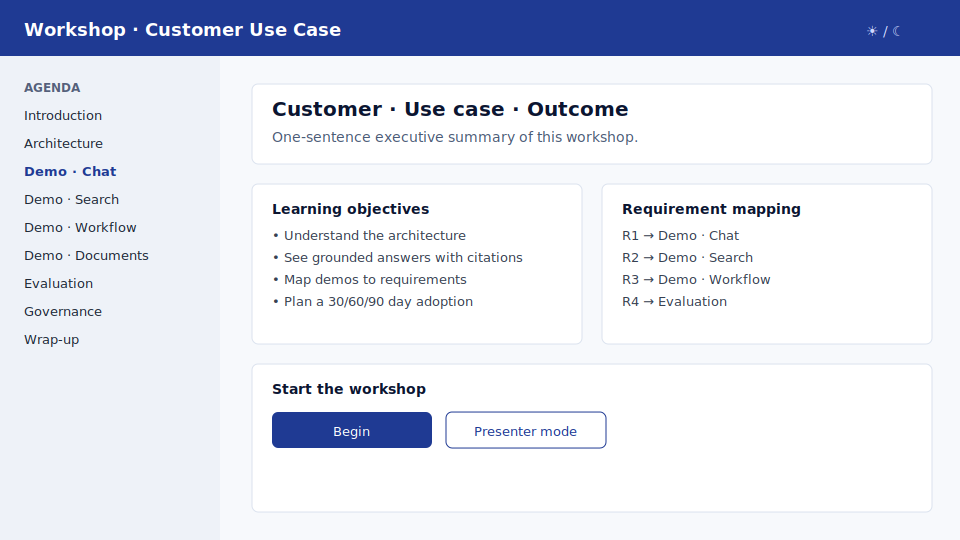
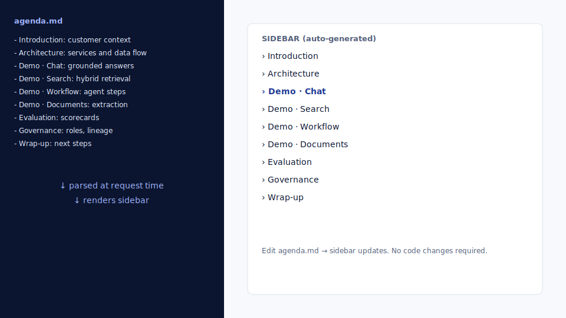
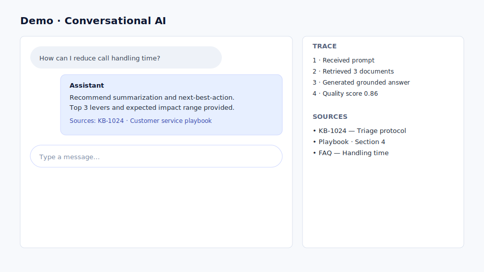
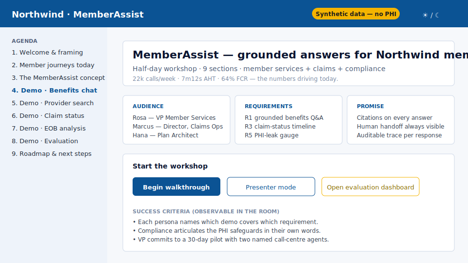
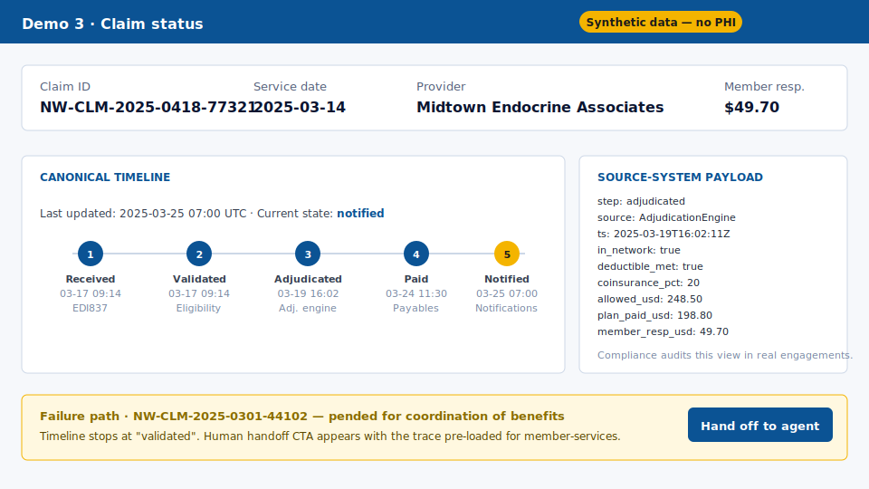
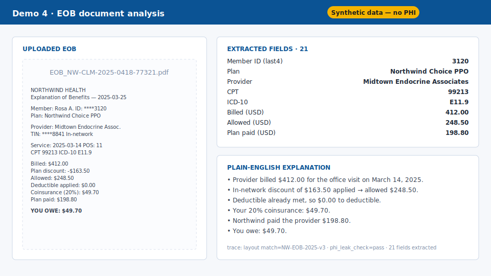
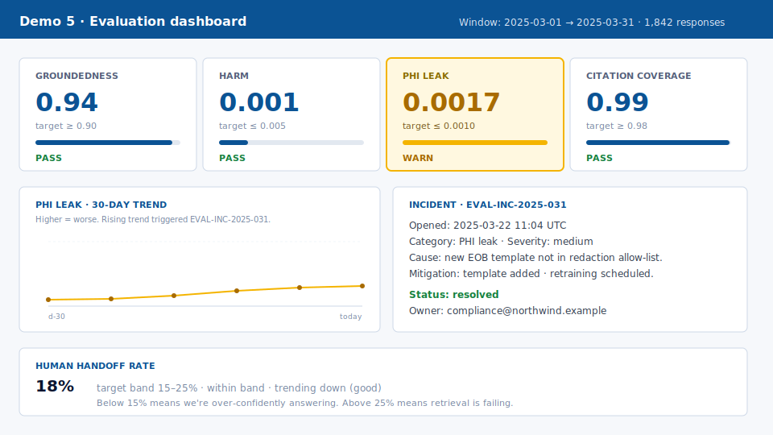
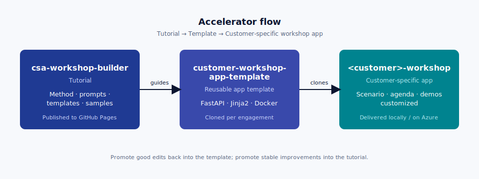

# Accelerator for customer workshops

# Build a customer-ready interactive workshop app with GitHub Copilot

Use this accelerator to **generate a working generic workshop web app**, then
**customize it for any customer, Microsoft product or use case** — in
hours, not weeks.

[Start the fast path :material-rocket-launch:](00-fast-path.md){ .md-button .md-button--primary }
[Learn the method :material-school:](02-design-principles.md){ .md-button }
[Use the app template :material-source-branch:](https://github.com/pedro-pauletti/customer-workshop-app-template){ .md-button }
[See the worked example :material-eye:](14-worked-example.md){ .md-button }

!!! success "What you will have after the fast path"
    A generic interactive workshop web app running locally — dynamic sidebar
    from `agenda.md`, explanatory sections, mock demos (chat, search,
    workflow, document analysis, evaluation), presenter notes, and
    requirement mapping. Ready to be customized for your customer.

**Working app, fast**
A runnable FastAPI/Jinja2/Docker app at the end of module 0.

**Agenda-driven**
Editing one markdown file (`agenda.md`) updates the navigation and sections.

**Reusable across products**
Same skeleton for Foundry, Fabric, Security, M365 Copilot, Dynamics, GitHub Copilot.

**Customer-specific in hours**
Swap scenario + demos; keep architecture stable.

## What it looks like

The generic skeleton:

A customized engagement (Northwind MemberAssist — see [module 14](14-worked-example.md)):

## The three-repo architecture

This accelerator is intentionally split across three repositories so the
**method**, the **template**, and each **customer engagement** can evolve
independently.

{ .screenshot }

| Repo | Role | Example |
|---|---|---|
| **`csa-workshop-builder`** *(this site)* | The tutorial — method, prompts, templates, samples. Published to GitHub Pages. | You're reading it. |
| **`customer-workshop-app-template`** | The reusable FastAPI/Jinja2 app template. Cloned for each engagement. | Generated by the Fast path. |
| **`<customer>-workshop`** | A customer-specific workshop app generated from the template and customized. | `samples/northwind-memberassist-workshop/` is the worked content; the running app is generated from it. |

!!! tip "Don't have the template repo yet?"
    The Fast path includes a Copilot prompt that scaffolds it from scratch
    using `SKILL.md` + `agenda.md`. You can build the template the first time
    you run the Fast path.

## Two trails

<table class="trails">
<tr>
<td>Fast path — 60–90 min</td>
<td>Clone the template, run Copilot, get a working generic app locally. Skip the theory until you need it.</td>
</tr>
<tr>
<td>Deep dive — full method</td>
<td>Understand SKILL.md, agenda.md, design principles, demo patterns, customization recipes, publishing.</td>
</tr>
</table>

[Start the fast path](00-fast-path.md){ .md-button .md-button--primary }

## How each module is structured

Each module follows the **same 9-section pattern**:

1. **Goal** — what you will produce.
2. **Why it matters** — how it improves the workshop.
3. **Inputs** — what you need before you start.
4. **Step-by-step** — concrete actions.
5. **Copilot prompt** — copy/paste ready.
6. **Expected output** — what success looks like.
7. **Validation checklist** — confirm before moving on.
8. **Common issues** — fast troubleshooting.
9. **Next step** — link to the next module.

## Prerequisites

- GitHub account with **GitHub Copilot** access (Copilot Chat with `/plan`).
- VS Code or GitHub.dev / Codespaces.
- Docker Desktop (the generated workshop app runs locally in containers).
- Python 3.11+ (only if you want to preview this tutorial site with `mkdocs serve`).
