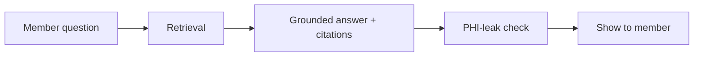

<!--
Section template — drop in to sections/<slug>/templates/index.html via Jinja
or render straight from this Markdown if the section is static.

Slot order is intentional: business framing first, technical depth last.
Do NOT reorder. Audiences filter by the first sentence under each heading;
moving "Concept" above "Customer context" makes the whole workshop feel
like a feature tour.
-->

# {{ Section title }}

> **Mapped requirement(s):** R?, R?
> **Time on stage:** ~?? minutes
> **Demo file:** `data/<demo>.json`

## Customer context

One sentence. Why this section exists for *this* customer. Vendor-neutral.
Names a persona by name.

## Concept

Two to four sentences. Plain English. No marketing adjectives. Define one
new term at most; link the rest.

## Diagram

A Mermaid diagram **or** an SVG. Must be readable at 1080p without zoom.
If you have to zoom, split it.

## Demo

Link to the embedded demo route, e.g. `/sections/<slug>`. State the *one*
thing the audience should watch for. Reference the matching JSON fixture
in `data/`.

## Evidence

The artifact in the room — citations, scorecards, trace, or a console
snippet. This is what compliance asks to see *after* the demo.

## Presenter notes

Two to four bullets. Written for *you* a month from now. Include the
sentence you say while the demo loads.

## Common pitfalls

One or two. The thing that always breaks in front of customers.

## Next

One sentence pointing to the next agenda item by title. Helps the audience
build a mental thread.
