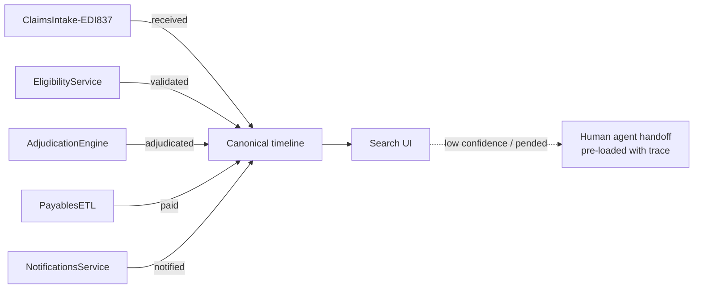

# Demo 3 — Claim status

> **Mapped requirement(s):** R3, R6
> **Time on stage:** ~18 minutes (8 explain, 7 demo, 3 Q&A)
> **Demo file:** `data/workflow.json`
> **Section folder:** `sections/demo_3_claim_status/`

## Customer context

Marcus (Director, Claims Ops) opens 28% of his weekly tickets because a
member called the call centre and the agent could not explain *where* a
claim was in flight. The agent had to alt-tab between three systems and
read codes the member did not understand. This demo shows the same
question answered in one screen, in plain English, with a timestamp the
member can trust.

## Concept

A claim moves through five canonical states: **received → validated →
adjudicated → paid → notified**. Each state is owned by a different
back-end system and emits an event. Search subscribes to those
events, normalises them to the canonical timeline, and renders them with
the source system and last-updated timestamp. Nothing is computed; we
show the truth that already exists.

The "human handoff" path matters here as much as the happy path. A
**pended** claim cannot be self-served — the demo shows the failure mode
explicitly so the audience does not assume the copilot will misrepresent
a stuck claim.

## Diagram



## Demo

Open `/sections/demo_3_claim_status` and run the **happy-path** claim
`NW-CLM-2025-0418-77321`:

1. Member asks "where is my claim from March 14?"
2. The timeline renders all five states with source-system badges and
   timestamps. Last-updated is shown prominently.
3. Click any node — the right panel shows the raw source-system payload
   (mock). Compliance audits this view in real engagements.
4. Switch to the **failure-path** claim `NW-CLM-2025-0301-44102`
   (pended for coordination of benefits). The timeline stops at
   "validated"; a human-handoff CTA appears with the trace pre-loaded.

Watch for: the "Synthetic data — no PHI" top-bar badge stays visible the
entire time. Compliance always asks.

## Evidence

The right-panel payload, the source-system badges, and the trace passed to
the handoff modal. All three are pulled from `data/workflow.json` so the
audience can see "what the model saw" — there is no hidden state.

```json
{
  "step": "adjudicated",
  "source_system": "AdjudicationEngine",
  "timestamp": "2025-03-19T16:02:11Z",
  "detail": "In-network office visit. Deductible already met. 20% coinsurance applied."
}
```

## Presenter notes

- **Open with Marcus's number**: "28% of your weekly escalations are
  variants of *where is my claim*. We're going to remove that ticket."
- While the timeline loads, say: "Notice we are not computing anything.
  Each badge is a system you already trust. We are just stitching."
- For the pended claim, *do not* skip the handoff modal. Compliance
  watches for it — if you skip, they will assume it is not there.
- If a member-services leader asks "can the bot also *resolve* the COB
  pend?" — answer: "Not in v1. Read-only. v2 conversation has to include
  legal and the COB vendor."

## Common pitfalls

- Demoing only the happy path. The failure-path claim is what makes the
  evaluation demo (Demo 5) credible later.
- Auto-advancing the timeline animation too fast. Set the per-step delay
  to 600 ms so the audience can read each badge.

## Next

Demo 4 — EOB document analysis. Same claim ID, now we open the EOB PDF
and extract the line items the member is being billed for.
